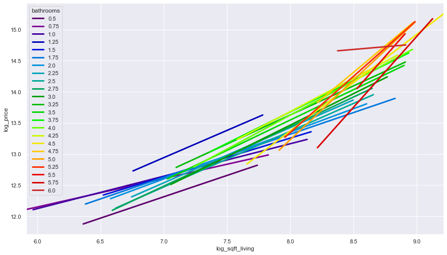
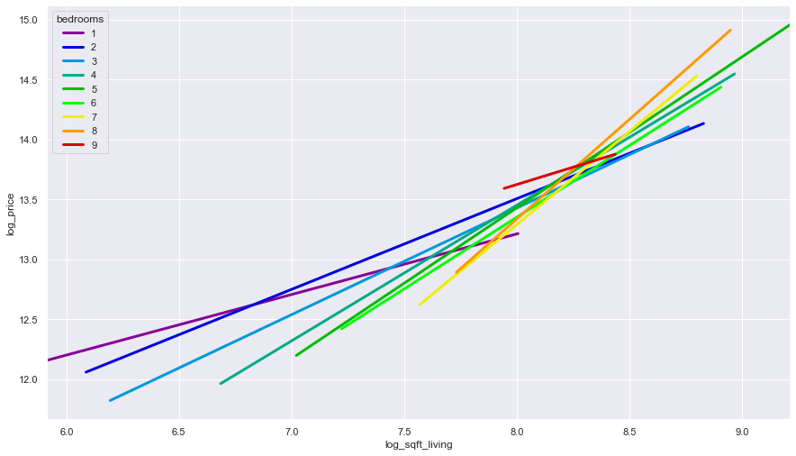
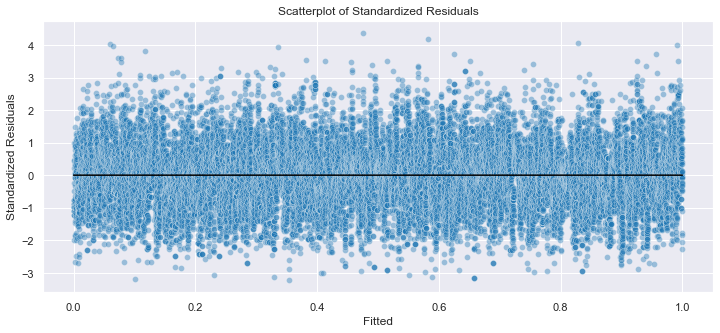
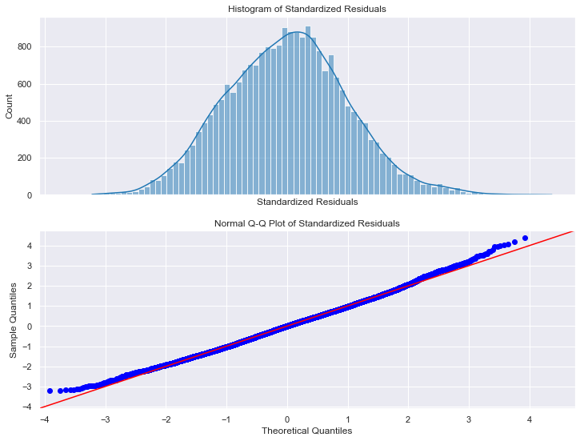
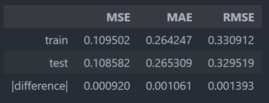
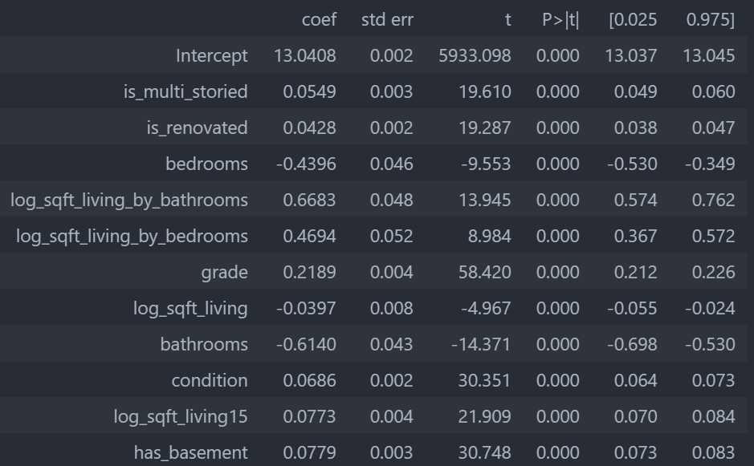

<script src="https://cdn.mathjax.org/mathjax/latest/MathJax.js?config=TeX-AMS-MML_HTMLorMML" type="text/javascript"></script>

# Building a Linear Regression Model to Estimate House Prices in *King County, Washington*

##### **Author: _Suleyman Qayum_**

<br>

## Business Understanding

A group of real estate agents in *King County* have recently started a company that builds custom homes. The company will primarily cater to those with a middle-class income who desire a classy, but not extravagant, home that is uniquely suited to their own tastes and lifestyle. Their main focus will be designing and constructiong homes that are affordable, and have superior equity value compared to similar homes on the market, benefitting their customers financially in the long term.

Furthermore, the company plans to design and construct homes based off some floor plan chosen by the customer. The process begins with the proposal of an initial floor plan by the customer, from which an initial estimate for the cost of the home is calculated based on the proposed floor plan. The initial proposal is either accepted or changed in order to bring the estimated cost in the customer's budget range. Once the proposal is approved, the next step involves maximizing the equity of the new home by making adjustments to the floor plan and recommending the best locations to look for a lot (if a lot has not been purchased by the customer yet). Once this second proposal is approved, the proposal stage is finished and the process moves on to drawing schematics from this floor plan.

However, the company lacks a robust way of accurately estimating and predicting the value of a home in *King County*. This renders them unable to compare the projected costs of their custom floor plans to similar houses on the market in *King County*, which means they can't actually gauge how affordable their homes will be with respect to other homes currently for sale in the county. Similarly, they have no way of estimating what the equity of one of their homes will be upon completion.

> *They require that a model be constructed that can accurately estimate the market value of a home in *King County*. Aditionally, the company specifies that the following types of parameters be included in the model:*
>
> * _physical attributes of the home_
> * _the location of the home/characteristics of the surrounding area_
> * _any other attributes that may be linked to a home's equity_

<br>

## Data Understanding

> *The data comprises of a single dataset describing over 20,000 home sales in _King County, Washington_ from May 2014 to May 2015.*

A description of each column in the dataset is listed below:

> * __id__ - _unique identifier for each home sold_
> * __date__ - _date of sale_
> * __price__ - _price at which home was sold_
> * __bedrooms__ - _number of bedrooms_
> * __bathrooms__ - _number of bathrooms, where:_
>    * *__0.5__ = half bath (sink + toilet)*
>    * *__0.75__ = three-quarter bath (sink + toilet + shower)*
>    * *__1__ = full bath (sink + toilet + shower + tub)*
> * __sqft_living__ - *square footage of the interior living space*
> * __sqft_lot__ - *square footage of the lot*
> * __floors__ - *number of floors*
> * __waterfront__ - *binary column indicating whether or not the home is a waterfront property*
> * __view__ - *index measuring how good the view is from the property [0 - 4]*
> * __condition__ - *index measuring the condition of the apartment [1 - 5]*
> * __grade__ - *index measuring quality of building construction and design [1 - 13]*
> * __sqft_above__ - *square footage of the interior living space other than the basement*
> * __sqft_basement__ - *square footage of the basement*
> * __yr_built__ - *year in which home was initially built*
> * __yr_renovated__ - *year of the most recent renovation*
> * __zipcode__ - *zipcode house is located in*
> * __lat__ - *latitude*
> * __long__ - *longitude*
> * __sqft_living15__ - *square footage of interior housing living space for the nearest 15 neighbors*
> * __sqft_lot15__ - *square footage of the land lots of the nearest 15 neighbors*


The distribution of data for the target variable (`price`) was heavily right-skewed. As for the predictors, it was apparent that:
* _```sqft_living, sqft_above, sqft_living15``` were moderately right-skewed_
* _```sqft_lot, sqft_lot15``` were extremely right-skewed_
* _the vast majority of values for ```yr_renovated, sqft_basement``` were zero_
* _`bedrooms` was right-skewed, with the majority of homes having between $2$ and $5$ bedrooms_
* _`bathrooms` was right-skewed, with the majority of homes having between $2$ and $4$ bathrooms_
* _`condition` was left-skewed, with the vast majority of homes having a rating of $3$ and above_

<br>

## Data Preparation

### *Dealing with Non-Numeric Columns*

The first issue addresed during data preparation was the inconsistent data type of the `sqft_basement` column. This column should have been numeric to begin with, yet its data type was listed as `object`, indicating the presence of non-numeric values. Upon further inspection it was discovered that $453$ of the entries in `sqft_basement` were simply a '`?`' character. It is unclear how this value should have been interpreted because it is difficult to imagine how confusion could arise over something as straightforward as the size of a basement. Nevertheless, it was assumed that these homes did not have a basement, and their values were correspondingly be set to `0`.

### *Handling Null (`NaN`) Values*

The second issue involved null values (`NaN`) in the `is_waterfront` and `yr_renovated` columns. For data in the `yr_renovated` column, a null value was assumed to mean that the house has never been renovated, and was replaced with the integer `0`. Similarly, a null value in the `is_waterfront` column was assumed to indicate that the house is not a waterfront property, and was replaced with the integer `0`.

### *Dealing with Homes that Appeared More than Once in the Dataset*

Additionally, some homes appeared more than once in the dataset. There were duplicate values in the `id` column because some properties in the dataset were listed on more than one occassion during the year the dataset was recorded. Their corresponding rows were identical, except for the values in the `date` and `price` columns. These observationscould indicate that seasonality may affect a home's seling price, but the business problem puts emphasis on investigating the physical and location-related attributes of a home. Thus, those records wereresolved into a single row by taking their average `price` value.

### *Identifying Multicollinearity*

The  `sqft_living`, `sqft_above`, and `sqft_basement` variables were related. In fact, it was determined that:

> $$\text{sqft\_living} = \text{sqft\_above} + \text{sqft\_basement}$$

Their Variance Inflation Factors were well above $10$, confirming that one of them was redundant, and `sqft_above` was dropped as a result. Furthermore, a correlation heatmap of the predictors showed that `sqft_lot`, `sqft_lot15`, and `yr_built` had virtually no correlation with `price`, and so they were dropped from the analysis as well.

<br>

### *Variable Processing & Feature Engineering*

The `sqft_living` and `sqft_living15` predictors were log-tansformed in order to reduce skew and make their distributions more normal.

The data for `sqft_basement` and `yr_renovated` consisted mostly of zeros. In order to make them more suitable as aparameters for a linear model,  they were converted into the binary columns `has_basement` and `is_renovated` respectively. Additionally, the `floors` variable was also converted into a binary column, called `is_multi_storied`, indicating whether or not a home had more than one floor.

<br>

## Modeling

> *Home prices will be modeled using the *Ordinary Least Squares* method of linear regression. Every model shown in the analysis is accompanied by:*
>   - *a summary of an OLS regression performed over the entire dataset*
>   - *a Scatterplot, Histogram, and Normal Q-Q Plot of the residuals from the above mentioned regression*
>   - *a table showing metrics resulting from the model being validated against a train-test split of the dataset*
>       - *the dataset was split with a test size o $30\%$*
>       - *`random_state=42` was passed to every call of `train_test_split` to ensure the same  pair of training and testing sets were being used to validate a given model
>       - *a `StandardScaler` object was always fitted to the training set first, with the resulting parameters used to transform the both the training and testing sets - this was done to make sure these datasets were being scaled with respect to the testing set, and not the dataset as a whole (i.e. to avoid data leakage)*

<br>

### *Parameter Selection*

 The following base model was constructed:

 > **`price ~ log_sqft_living + log_sqft_living15`**

 However, the residuals from this model were non-normal and heteroskedastic. The target variable was log-transformed in order to remedy this, which greatly improved the normality and homoskedacity of the residuals, along with the $R^2$. Thus, the base model became:

> **`log_price ~ log_sqft_living + log_sqft_living15`**

Predictors were added to this model in a step-wise fashion. Every single predictor added was stastically significant. Due to the large number of observations in the dataset, no penalties were seen in $R^2_\text{adjusted}$.

Upon completing parameter selection, the model was improved to:

> **`log_price ~ log_sqft_living + log_sqft_living15 + grade + has_basement + is_renovated + is_multi_storied + condition`**

The `grade`, `has_basement`, `is_renovated`, `is_multi_storied`, and  `condition`predictors were deemed suitable as parameters to the linear model because their coefficients were significant and they improved $R^2_\text{adjusted}$ by an appreciable degree.

The 'Is_waterfront` predictor was discarded because its ceoefficient was very small relative to the others, and its effect on $R^2_\text{adjusted}$ was negligible.

The main issues during parameter selection were the `bathrooms` and `bedrooms` variables. These predictors were crucial with respect to the business problem, but they both had a slightly negative coefficient, indicating that adding a bathroom/bedroom decreases the value of a home. This was unacceptable. A solution to this problem was found by searching for interactions involving these predictors.


### *Searching for Interactions*

The number of bedrooms and bathrooms in a home is related to its square footage, and so `price` was plotted against `log_sqft_living` for each possible value of `bathrooms` and `bedrooms`.

*The interactions of `log_sqft_living` with `bathrooms` and `bedrooms` are shown in the regression plots below:*

<center>
</center>

<br>

It can be clearly seen that a home's *price per square foot* interacts strongly with the number of bathrooms and bedrooms. Therefore, both of these interaction terms were applied to the model to allow for a more meaningful and realistic interpretation of the `bathrooms` and `bedrooms` variables.

<br>

## Evaluation

### *Results*

The interaction terms were modeled individually and together. The model with both interaction terms was chosen as the final product. With an $R^2_\text{adjusted}$ of $0.606$, the model accounts for around $60\%$ of the variation in the dataset. The equation describing this model is shown below:

> **`log_price ~ log_sqft_living + log_sqft_living15 + grade + has_basement + is_renovated + is_multi_storied + condition + bathrooms + bedrooms + {log_sqft_living | bathrooms} + {log_sqft_living | bedrooms}`**

The model residuals show constant variance, and so this model adheres to the assumption of homoskedadicity. This is illustrated in the scatterplot of the residuals, shown below:

<center></center>

The residuals are essentially normally distributed, with $skew = 0.067$ and $kurtosis = 3.059$, and so this model also adheres to the assumption of normality of the residuals. The normality of the residuals can be seen in the histogram and normal Q-Q plot of these residuals, shown below:

<center></center>

The validation results indicate that the model can effectively predict house prices in *King County*. A table summarizing these results is shown below:

<center></center>


The model has a total of $11$ parameters. All of the parameters were statisticaly significant. A summary of these parameters is given in the table below:

<center></center>
<br>

> ##### $\beta_{\text{\{log-sqft-living\}}}$, $\beta_{\text{\{log-sqft-living | bathrooms\}}}$, & $\beta_{\text{\{log-sqft-living | bedrooms\}}}$

* $\beta_{\text{\{log-sqft-living\}}}$ describes the percentage increase in price per $1\%$ increase in square footage of the home *given there 0 bathrooms and 0 bedrooms*
* $\beta_{\text{\{log-sqft-living | bathrooms\}}}$ describes how $\beta_{\text{\{log-sqft-living\}}}$ changes with respect to the number of bathrooms in the home. In other words, if a single full bathroom were to be added to a home, the model will account for this by adding $[\dfrac{1}{s_\text{bathrooms}}] \times \beta_{\text{\{log-sqft-living | bathrooms\}}}$ to $\beta_{\text{\{log-sqft-living\}}}$
* $\beta_{\text{\{log-sqft-living | bedrooms\}}}$ describes how $\beta_{\text{\{log-sqft-living\}}}$ changes with respect to the number of bedrooms in the home. In other words, if a single bedroom were to be added to a home, the model will account for this by adding $[\dfrac{1}{s_\text{bedrooms}}] \times \beta_{\text{\{log-sqft-living | bedrooms\}}}$ to $\beta_{\text{\{log-sqft-living\}}}$
[Note: $s_x$ = standard deviation of feature]

$\beta_{\text{\{log-sqft-living\}}} = -0.0397$ means that price decreases about $0.04\%$ for a $1\%$ increase in square footage of the living area. This relatively small, negative change is counter-intuitive. It arises from the fact that, as `log-sqft-living` increases, so will `bathrooms` and `bedrooms`, which means  $\beta_{\text{\{log-sqft-living\}}}$ is adjusted by $\beta_{\text{\{log-sqft-living | bathrooms\}}}$ or $\beta_{\text{\{log-sqft-living | bedrooms\}}}$ everytime the total number of rooms change. Thus, all of the variance that was explained by $\beta_{\text{\{log-sqft-living\}}}$ before the interaction terms were present is now being captured by $\beta_{\text{\{log-sqft-living | bathrooms\}}}$ and $\beta_{\text{\{log-sqft-living | bedrooms\}}}$. In fact, the value of $\beta_{\text{\{log-sqft-living\}}}$ by itself is no longer relevant because it is now valid only when there are no bathrooms and bedrooms (which is a theoretical situation).

$\beta_{\text{\{log-sqft-living | bathrooms\}}} = 0.6683$ means that $\beta_{\text{\{log-sqft-living\}}}$ increases by ${0.6683}$ for every unit increase in the number of bathrooms.
Likewise, $\beta_{\text{\{log-sqft-living | bedrooms\}}} = 0.4694$ means that $\beta_{\text{\{log-sqft-living\}}}$ increases by ${0.4694}$ for every unit increase in the number of bedrrooms.

> ##### $\beta_{\text{\{bathrooms\}}}$ & $\beta_{\text{\{bedrooms\}}}$

* $\beta_{\text{\{bathrooms\}}}$ describes the percentage increase in price for every unit bathroom added *given that the square footage of the home is 0*
* $\beta_{\text{\{bedrooms\}}}$ describes the percentage increase in price for every unit bedroom added *given that the square footage of the home is 0*

 Similar to what was explained above, this counter-intuitive result stems from the fact that most all the variance that was explained by $\beta_{\text{\{bathrooms\}}}$ and  $\beta_{\text{\{bedrooms\}}}$ before the interaction terms were present is now being captured by $\beta_{\text{\{log-sqft-living | bathrooms\}}}$ and $\beta_{\text{\{log-sqft-living | bedrooms\}}}$. These coefficients are no longer relevant because they are valid only when the square footage is $0$ (which is impossible).

> ##### $\beta_{\text{\{log-sqft-living15\}}}$, $\beta_{\text{\{grade\}}}$, $\beta_{\text{\{condition\}}}$, $\beta_{\text{\{is-multi-storied\}}}$, $\beta_{\text{\{is-renovated\}}}$, & $\beta_{\text{\{has-basement\}}}$

* $\beta_{\text{\{log-sqft-living15\}}} = 0.0773$ means that price increases by $0.0773\%$ per $1\%$ increase in the average home square footage of the 15 nearest neighbors

* $\beta_{\text{\{grade\}}} = 0.2189$ means that price increases by $[e^{\beta_{\text{\{grade\}}}} - 1] * 100\% = 24.47\%$ per unit increase in rating for the home's grade

* $\beta_{\text{\{condition\}}} = 0.0686$ means that price increases by $[e^{\beta_{\text{\{condition\}}}} - 1] * 100\% = 7.10\%$ per unit increase in rating for the home's condition

* $\beta_{\text{\{is-multi-storied\}}} = 0.0549$ means that the price increases by $[e^{\beta_{\text{\{is-multi-storied\}}}} - 1] * 100\% = 5.64\%$ when going from a single-story home to a home with two or more stories

* $\beta_{\text{\{is-renovated\}}} = 0.0428$ means that the price increases by $[e^{\beta_{\text{\{is-renovated\}}}} - 1] * 100\% = 4.38\%$ when going from a home that has never been renovated to one that has been renovated at least once

* $\beta_{\text{\{has-basement\}}} = 0.0779$ means that the price increases by $[e^{\beta_{\text{\{has-basement\}}}} - 1] * 100\% = 8.10\%$ when going from a home without a basement to one that does have a basement

### *Conclusion*

As for evaluating the price of homes in *King County*, the most important attributes are:
> * grade (quality of building construction and design)
> * square footage of the living area
> * number of bathrooms
> * number of bedrooms

With respect to the company building homes, all of the features described by the model can and should be used to estimate the selling price of a given home in *King County*.

When pricing their own custom homes, the square footage, number of bathrooms, and number of bedrooms will be the most important features since the model takes into account the interactions between these attributes. In total, the company will be able to use the following set of features when pricing their homes:

> * square footage of the living area
> * the average square footage of the nearest 15 neighbors to the lot where the home will be built
> * number of bathrooms
> * number of bedrooms
> * whether or not the home will have multiple stories
> * whether or not the home will have a basement
> * condition (assuming the newly built home to have a rating of 5/5)

### *Limitations & Ideas for Further Analysis*

The model explains about $%60$ of the variation of home prices in *King County*, and so needs further improvement. More analysis should be done on how location and seasonality affect prices. Also, the company should consider exploring features that are demographic in nature, instead of relying solely on real estate data, since we could be omitting important variables. For example, gathering census data on the average income per household.

As for grade, the company needs to investigates how exactly this rating is determined in *King County* due to its important as a predictor. Without an understanding of how this rating is assigned, it cannot be used to price custom homes, and the accuracy of the model will suffer greatly. Going further, since grade seems to be holistic, thorough research into this predictor would allow us to distill it out the more fundamental attibutes on which grade depends. These attributes would be much more suitable for use in a model, and would paint a clearer picture of the underlying factors that determine house prices in this county.

